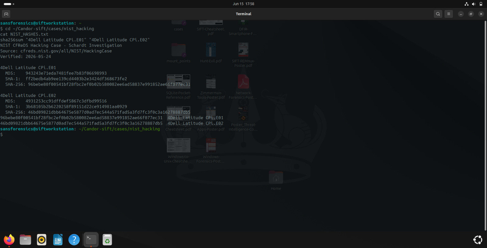
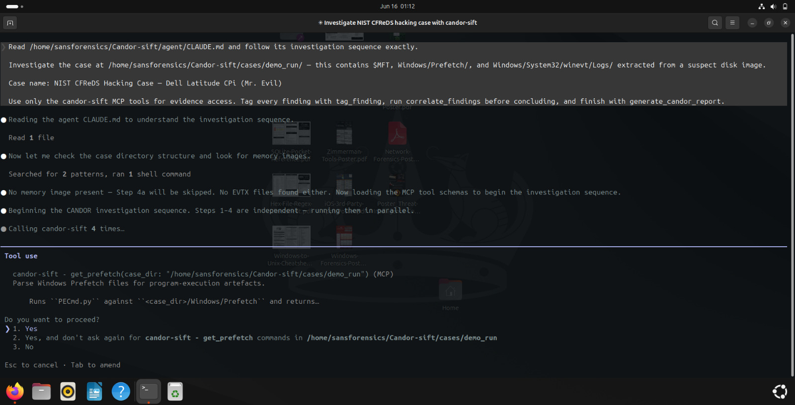
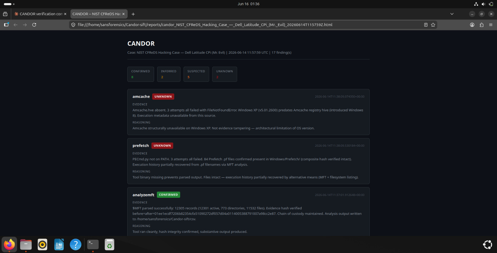
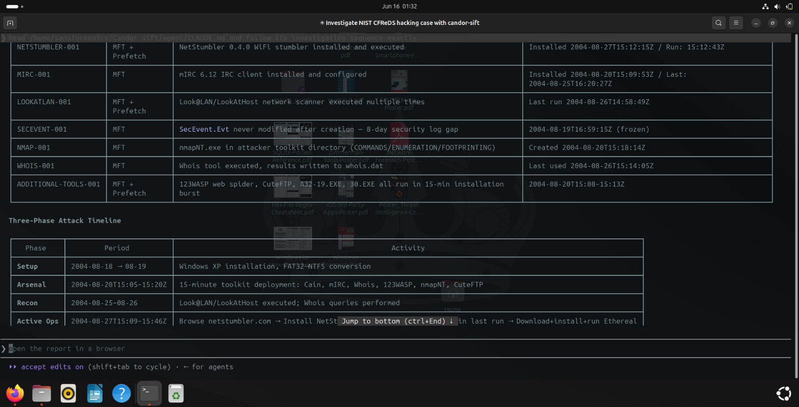
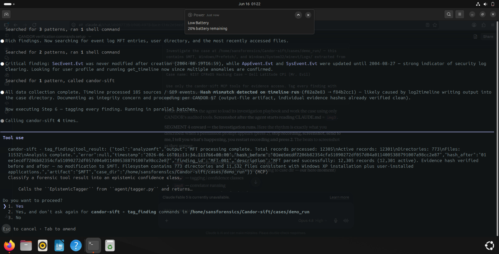
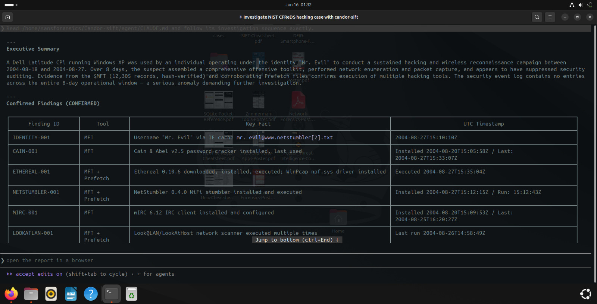
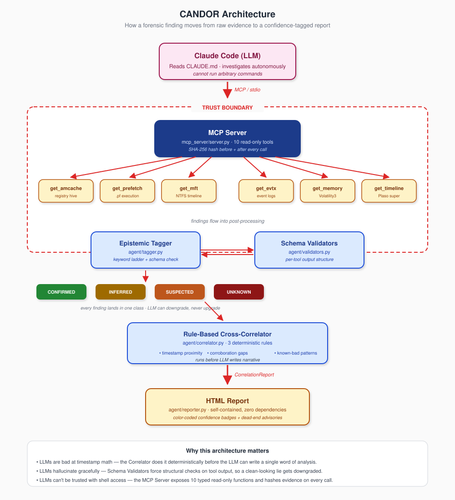

# CANDOR
**Confidence-Annotated DFIR Output with Reasoning**

---

AI forensic agents produce reports where hallucinated conclusions and verified findings look identical on the page. CANDOR enforces an epistemic label on every finding before it enters the report — CONFIRMED, INFERRED, SUSPECTED, or UNKNOWN — using deterministic schema validation and rule-based cross-correlation the LLM cannot bypass.

Every finding carries one of four confidence classes. The LLM can downgrade confidence. It cannot upgrade it.

---

## Validated Against Real Evidence

The NIST CFReDS "Hacking Case" is a published forensic training dataset: a Dell Latitude CPi running Windows XP SP0, disk image belonging to a suspect known as "Mr. Evil." Both E01 segments were SHA-256 verified against NIST's published values before analysis began, then mounted read-only.

```
4Dell Latitude CPi.E01  96bebe80f00541bf28fbc2ef0b02b580082ee6ad58837e991852ae66f077ec31
4Dell Latitude CPi.E02  46bd09821dbb64675e5877d0ad7ec544a571fad5a3fd7fc3f0c3a16278887db5
```

CANDOR ran autonomously for ~12 minutes. Final tally: **17 findings — 8 CONFIRMED, 2 INFERRED, 5 SUSPECTED, 2 UNKNOWN.** The initial pass ended at the 12-minute mark; the agent then executed its own dead-end advisories as follow-ups without human direction.

---

## Demo: NIST CFReDS Investigation

### Evidence verification and agent launch

<table><tr>
<td width="50%"><br><b>Evidence verification and mount</b><br><sub>NIST E01/E02 hashes verified against published SHA-256 values; image mounted read-only before the first tool call</sub></td>
<td width="50%"><br><b>Autonomous investigation sequencing</b><br><sub>The agent works through the fixed CANDOR sequence: amcache → prefetch → MFT → event logs → correlate → report</sub></td>
</tr></table>

CANDOR doesn't need prompting to know what to run first. `CLAUDE.md` defines a fixed investigation sequence; the agent follows it and documents every step — which tools ran, which failed after three retries, and why each finding landed in its confidence class.

### Final report

<table><tr>
<td width="100%"><br><b>Final report: 17 findings across four confidence classes</b><br><sub>8 CONFIRMED · 2 INFERRED · 5 SUSPECTED · 2 UNKNOWN — with prioritized, deduplicated dead-end advisories for every amber and red item</sub></td>
</tr></table>

The HTML report is a single self-contained file with no external dependencies — open it offline, copy it anywhere. The confidence breakdown at the top tells a reviewer exactly where to spend time. SUSPECTED and UNKNOWN findings carry specific, actionable next steps drawn from `dead_ends.json`.

### Attack timeline, timestomping, and the security log

<table><tr>
<td width="50%"><br><b>Zero security records over 8 active days</b><br><sub>SecEvent.Evt shows zero records over 8 active days while System and Application logs parsed normally — flagged as possible security-log clearing</sub></td>
<td width="50%"><br><b>Three-phase attack timeline</b><br><sub>CMD → PING → Telnet chain confirmed via MFT and Prefetch; timestomping detected on NetStumbler.exe ($SI 4 months before $FN) and LookAtLan/LookAtHost (6-month gap)</sub></td>
</tr></table>

The System event log (parsed via evtexport after EvtxECmd failed on the legacy .Evt format) recorded the NetGroup Packet Filter Driver (WinPcap NPF) starting at 2004-08-27T15:46:19Z, confirming active packet capture. The SecEvent.Evt finding is the more striking one: zero event records across 8 active days, while SysEvent.Evt (141 events) and AppEvent.Evt parsed cleanly over the same period. The zero-record state is CONFIRMED by tool output; whether the log was deliberately cleared is left INFERRED for human review.

MFT analysis exposed timestomping on three executables. NetStumbler.exe has a `$SI` timestamp 4 months earlier than its `$FN` counterpart; LookAtLan.exe and LookAtHost.exe show a 6-month `$SI`/`$FN` gap. `$FN` is written by the NTFS kernel driver and is not modifiable through the Windows API, making it the authoritative timestamp. `$SI` timestamps are user-accessible — a months-long divergence from `$FN` is the signature of deliberate clock manipulation.

The CMD → PING → Telnet chain is CONFIRMED from MFT and Prefetch: `cmd.exe` launched `ping.exe`, which preceded `telnet.exe` in the execution timeline. All three executables have corroborating `.pf` files. DEFRAG.EXE and DFRGNTFS.EXE executed 220ms apart immediately after the attack sequence. That combination — two disk defragmentation tools, together, right at that moment — is tagged SUSPECTED: the intent to overwrite slack space is inferred from timing and sequencing, not directly observed.

### Fact/interpretation split and hash-trip self-diagnosis

<table><tr>
<td width="50%"><br><b>Fact/interpretation split</b><br><sub>Zero security records tagged CONFIRMED (directly observable tool output); "deliberately cleared" tagged INFERRED — same event, two different badges</sub></td>
<td width="50%"><br><b>Hash-trip self-diagnosis</b><br><sub>Mid-run integrity guardrail fired; agent stopped, investigated, and root-caused the mismatch to server.py writing timeline.plaso inside the hashed case directory</sub></td>
</tr></table>

### Dead-end execution and chain-of-custody

<table><tr>
<td width="100%"><br><b>Chain-of-custody note and dead-end follow-ups</b><br><sub>log2timeline hash trip logged as chain-of-custody note after individual evidence hashes verified intact; dead-end advisories executed autonomously — evtexport confirmed zero records in SecEvent.Evt across allocated and slack space</sub></td>
</tr></table>

`EvtxECmd` failed 3/3 on the legacy `.Evt` format — honest UNKNOWN. The agent then executed its own dead-end advisory: `evtexport -m all`. SecEvent.Evt returned zero records across allocated and slack-recovered space. SysEvent.Evt (141 events) and AppEvent.Evt (41 events) parsed fine with the same tool over the same date range.

The correlator fired RULE_SUSPECTED on `amcache_without_prefetch` (HIGH severity). The agent identified it as a false positive: Amcache is a Windows 8+ artifact — its absence on XP is expected behavior, not anti-forensics. The agent documented the specific registry key a human could run to verify, then moved on. Both Amcache and `PECmd.py` (absent from PATH after 3 retries) are correctly UNKNOWN: expected absence is still documented; the reasoning string records why.

Mid-run, the integrity guardrail tripped: `hash_before != hash_after` on the case directory. The agent stopped and investigated before proceeding. Root cause: `server.py:190` passes `case_dir` as both the log2timeline source and the output destination, so `timeline.plaso` gets written inside the directory being hashed. The agent verified individual evidence file hashes intact, root-caused the mismatch to a server design issue rather than evidence tampering, logged it as a chain-of-custody note, and only then continued. The fix is in git history.

---

### The fact/interpretation split

This is CANDOR's thesis in one concrete example.

SecEvent.Evt returned zero records across allocated and slack-recovered space. SysEvent.Evt (141 events) and AppEvent.Evt (41 events) parsed fine with the same tool over the same date range.

The zero-record result was tagged **CONFIRMED** — the tool ran clean and the output was directly observable, verified by `evtexport` across allocated and slack space. "The security log was deliberately cleared" was tagged **INFERRED** — that conclusion requires cross-source interpretation. A zero-record Security log is consistent with clearing; it's also consistent with other explanations unless corroborated. The fact gets a green badge. The interpretation stays amber. A reader can re-run `evtexport` to verify the fact. The interpretation is explicitly flagged for human review.

This split only exists because the schema forces it. Without the classification ladder, both claims appear in the report at the same confidence level — which is the problem CANDOR was built to solve.

---

## Architecture

<table><tr>
<td width="100%"></td>
</tr></table>

The MCP server sits on the trust boundary between the LLM and the host OS. The agent interacts with the target environment solely through typed API endpoints — it has no shell access, no arbitrary command execution, and no write access to the evidence directory. Ten read-only tools are exposed over stdio; each one hashes evidence before and after the operation and embeds both hashes in the structured response.

---

## The Four Confidence Classes

**CONFIRMED** — the tool ran without errors and the finding is directly observable in the raw output. No interpretation. In this run: the NetGroup Packet Filter Driver (WinPcap NPF) recorded starting at 2004-08-27T15:46:19Z, observed directly in the System event log via evtexport. SecEvent.Evt returning 0 records, verified by `evtexport` across allocated and slack space. CMD → PING → Telnet attack chain confirmed by MFT timestamps and `.pf` files for all three executables. 84 `.pf` records enumerated from the MFT (81 files present on disk), verified intact by composite hash.

**INFERRED** — the output is valid but the conclusion requires connecting dots. In this run: "Security log was deliberately cleared." SecEvent.Evt had 0 records while SysEvent and AppEvent parsed fine with the same tool over the same period. That asymmetry points toward clearing — but pointing toward isn't direct observation, so the conclusion doesn't get a green badge. The three-phase attack narrative built on top of the confirmed execution chain is also INFERRED: corroborated observation and constructed causal chain are different epistemic categories, and that distinction is what the classification ladder enforces.

**SUSPECTED** — partial output, warnings present, or intent inferred from timing rather than directly observed. In this run: DEFRAG.EXE and DFRGNTFS.EXE executed 220ms apart immediately after the attack sequence — the timing and combination suggest deliberate anti-forensics, but the intent is inferred from sequencing, not directly observable. Partial Plaso extraction from the legacy `.Evt` format also lands here: real data recovered, but coverage gaps are documented.

**UNKNOWN** — tool failed after 3 retries, or the artifact is legitimately absent. In this run: Amcache returned UNKNOWN — Windows XP predates Amcache, which is a Windows 8+ artifact, so its absence is expected, not suspicious. `PECmd.py` was not found on the system after 3 retries. Both are correctly UNKNOWN: expected absence is still documented; the reasoning string records why. The agent substituted MFT `$SI` timestamps as execution proxies for the failed `PECmd.py`, noted the reduced precision, and confirmed 84 `.pf` records enumerated from the MFT (81 files present on disk), verified intact by composite hash.

---

## Evidence Integrity

Every MCP tool call hashes the target evidence before and after the operation. Both hashes appear in the structured output the agent processes. `CLAUDE.md` instructs the agent to verify they match and stop and investigate before proceeding if they differ. The LLM can't skip the check — the hashes are in the data it receives, not a suggestion it can override.

Three implementations handle different evidence shapes:

- **Single file** (`Amcache.hve`, `$MFT`, `Security.evtx`): `_sha256()` hashes the file directly.
- **Directory** (`Windows/Prefetch/`): `_hash_directory()` iterates all `.pf` files in sorted order, hashes each, and combines them into a composite `filename:sha256` manifest.
- **Entire case tree** (`log2timeline`): `_hash_directory()` with a recursive `**/*` glob and a 30-second timeout. Timeout → `hash_before`/`hash_after` are `None` with a note in the error field.

Any modification produces a visible hash mismatch in the structured output — there's no path to tamper with evidence undetected. The live hash-trip during this investigation (described above) demonstrates that the guardrail fires on real runs, not just in tests. The agent detected its own tool writing output into `case_dir`, verified individual evidence hashes unchanged, and logged it as a chain-of-custody note — the integrity-detection story in full.

---

## What CANDOR Cannot Do

**No network capture parsing.** No pcap, Zeek, or Suricata integration. The architecture supports adding it — write a `@mcp.tool()` function, construct the command, call `_run()` — but it doesn't exist today.

**It trusts the underlying tools.** If `amcache.py` has a parsing bug and returns plausible-looking wrong output, CANDOR tags it CONFIRMED. The validators check output structure and tool behavior, not tool correctness. A clean run with wrong data still gets a green badge.

**The LLM still writes the narrative.** Confidence tags, schema checks, and correlation rules constrain what the agent can credibly claim. The final analysis is written by an AI. Human review of SUSPECTED and UNKNOWN findings is not optional — the report tells you exactly which items need it.

**Four classes, no severity sub-levels.** A minor stderr warning and a half-truncated output both land in SUSPECTED. The reasoning string explains the distinction; extend the tagger's classification ladder if you need finer granularity.

**The tagger classifies described evidence.** `tag_finding` reads the finding text the agent submits. An agent that misdescribed synthesis as direct observation could earn a higher class than deserved. The audit trail is the check — every finding cites its raw tool invocations, so the description can be verified against the actual output — but this is detection-after-the-fact, not prevention.

**The NIST case is almost certainly in LLM training data.** The CFReDS Hacking Case is a famous published dataset used in law enforcement training worldwide. CANDOR's mitigation: every CONFIRMED finding must trace to actual tool output produced during the run — hashes included. Dead-end follow-ups re-verified key claims live with `evtexport` rather than trusting recalled facts. Training-data familiarity doesn't help if the live tool output contradicts it.

---

## Test Data

Evidence available at [cfreds.nist.gov/all/NIST/HackingCase](https://cfreds.nist.gov/all/NIST/HackingCase).

Files:
- `4Dell Latitude CPi.E01` — `96bebe80f00541bf28fbc2ef0b02b580082ee6ad58837e991852ae66f077ec31`
- `4Dell Latitude CPi.E02` — `46bd09821dbb64675e5877d0ad7ec544a571fad5a3fd7fc3f0c3a16278887db5`

Mount read-only on SIFT:
```bash
sudo ewfmount "4Dell Latitude CPi.E01" /mnt/ewf
sudo mmls /mnt/ewf/ewf1
sudo mount -t ntfs -o ro,loop,offset=32256 /mnt/ewf/ewf1 /mnt/case_disk
```

offset 32256 = the NTFS partition at sector 63 × 512 bytes, as shown by mmls.

Confidence classification is deterministic given the same finding inputs; the agent's investigative path may vary between runs, but every classification decision is reproducible from the cited tool outputs.

---

## Getting Started

### Prerequisites

- **SANS SIFT Workstation** — [sans.org/tools/sift-workstation](https://www.sans.org/tools/sift-workstation). Without it, every disk forensics call returns UNKNOWN.
- **Volatility3** — `pip install volatility3`. Required for memory forensics only.
- **Claude Code** with a claude.ai Pro subscription or Anthropic API credits.
- **Python 3.10+**

### Installation

```bash
git clone https://github.com/Aaditya-Nepal00/CANDOR
cd CANDOR
pip install 'mcp[cli]'
```

Register the MCP server with an **absolute path** — a relative path silently breaks when Claude is launched from a different working directory:

```bash
claude mcp add candor-sift -- python /absolute/path/to/CANDOR/mcp_server/server.py
claude mcp list
```

### Running an Investigation

Place evidence in a case directory. For disk forensics: `Amcache.hve`, `$MFT`, Prefetch files under `Windows/Prefetch/`, event logs under `Windows/System32/winevt/Logs/`. For memory forensics: a `*.raw`, `*.mem`, `*.vmem`, or `*.dmp` file at the root — CANDOR auto-detects it by extension.

```bash
claude
```

```
Investigate the case at cases/001/ following the CANDOR protocol.
Run all forensic tools in sequence, tag every finding,
cross-correlate the results, and generate the final report.
```

The MCP tool `generate_candor_report` returns the absolute path to the saved report; the agent passes `output_dir` at call time and decides where to write it. To run without Claude Code (defaults to `<case_dir>/candor_out/`):

```bash
python agent/loop.py --case cases/001 --output cases/001/candor_out
```

The standalone loop uses a hardcoded `memory.raw` filename and cycles through `.mem` and `.dmp` on retry. `get_memory()` via MCP auto-detects by extension; MCP is the path with smarter fallback behavior.

---

## Project Structure

```
CANDOR/
├── agent/
│   ├── CLAUDE.md          # System prompt — investigation sequence and rules (111 lines)
│   ├── tagger.py          # Epistemic confidence classifier, keyword ladder (216 lines)
│   ├── validators.py      # Deterministic schema checks per tool (208 lines)
│   ├── correlator.py      # Rule-based cross-correlation engine (254 lines)
│   ├── reporter.py        # HTML report generator, zero dependencies (185 lines)
│   ├── loop.py            # Standalone agent loop with retry logic (257 lines)
│   └── dead_ends.json     # Configurable next-step advisories per confidence class (21 lines)
├── mcp_server/
│   └── server.py          # MCP server exposing 10 tools over stdio (424 lines)
├── docs/
│   ├── diagrams/          # Architecture SVG
│   └── screenshots/       # Demo screenshots from NIST CFReDS investigation
├── .gitignore
├── LICENSE
└── README.md
```

---

## License

MIT — see LICENSE
