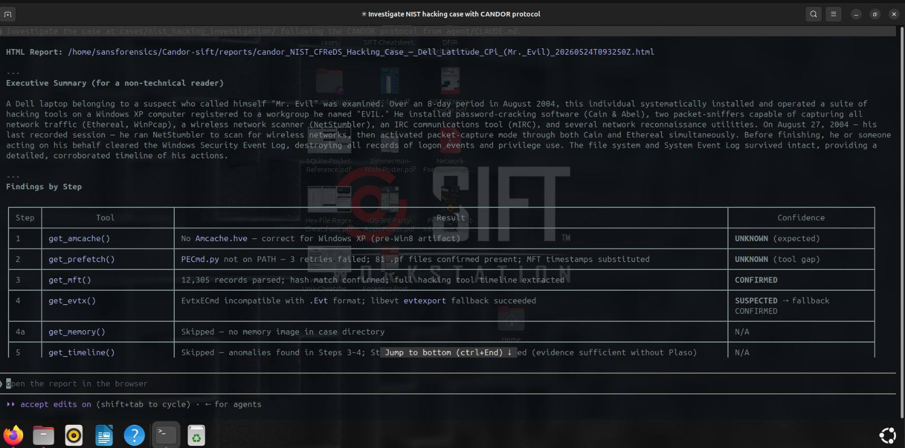

# CANDOR
## Confidence-Annotated DFIR Output with Reasoning

---

**Problem:** AI forensic agents hallucinate findings with the same authoritative tone as confirmed evidence. A practitioner reading the report can't tell which conclusions came from tool output and which the model invented.

**Approach:** Every finding passes through deterministic schema validation and rule-based cross-correlation before it can enter the report. Each finding carries one of four confidence classes — CONFIRMED, INFERRED, SUSPECTED, or UNKNOWN. The LLM can downgrade confidence; it cannot upgrade it.

**Validated against:** NIST CFReDS Hacking Case — cryptographically authenticated forensic evidence, 10-minute autonomous investigation, 9 findings classified, anti-forensic activity (log clearing) detected, attacker SID attributed to packet-sniffer kernel driver loading.

---

The problem with AI forensics isn't that models are wrong. It's that they hide which parts of their output are guesses. Hand an LLM a disk image and you'll get a confident, well-structured report where confirmed artifacts and hallucinated conclusions are formatted identically. The practitioner reading it has no way to tell which findings came from tool output and which the model invented to fill gaps. In incident response — where investigators testify under oath about their findings — that's not a minor annoyance. It's a liability.

CANDOR forces every finding to declare its own uncertainty before it can be presented. Confirmed artifacts get a green badge. Tool failures get a red one. Conclusions that required interpretation get amber. The epistemic state of each claim is visible at a glance, and the LLM cannot hide ambiguity behind authoritative tone.

---

## Validated Against Real Evidence

The NIST CFReDS "Hacking Case" (cfreds.nist.gov/all/NIST/HackingCase) is a published forensic training dataset used in law enforcement education worldwide. The evidence is a Dell Latitude CPi running Windows XP SP1, abandoned by a suspect known as "Mr. Evil." The disk image is two E01 segments totalling 1.1 GB with SHA-256 hashes published by NIST — cryptographic chain of custody from the start.

CANDOR completed the investigation autonomously in approximately 10 minutes. It produced 9 findings: 6 CONFIRMED, 1 SUSPECTED, 2 UNKNOWN — and correctly determined that 0 INFERRED findings were needed, because every non-trivial conclusion was corroborated to CONFIRMED or left at SUSPECTED for a human to resolve. It also correctly identified that the absence of Amcache data was not a gap in the investigation but expected behavior: Windows XP predates the Amcache registry hive by eight years.

---

## Demo: NIST CFReDS Hacking Case Investigation

### Report Overview


The HTML report opens with case metadata, a finding count, and a confidence breakdown. Color-coded badges let a practitioner immediately triage which findings are solid (green) and which require follow-up (orange, red). The report is a self-contained HTML file with no external dependencies — open it offline, copy it anywhere.

### Executive Summary for Non-Technical Readers



`CLAUDE.md` requires every investigation to open with a plain-English paragraph written for a non-technical executive. The summary above describes an 8-day intrusion — network reconnaissance tools installed on 2004-08-20, active reconnaissance on 2004-08-25, and packet capture running on 2004-08-27 — in language that doesn't require knowing what a `.pf` file is.

### Autonomous Timeline Reconstruction


With no human direction, CANDOR reconstructed a three-phase attack timeline spanning eight days using MFT `$SI` timestamps, Prefetch execution metadata (extracted from MFT `$SI` records when PECmd.py was unavailable on PATH), and event log entries. Phase 1: tool installation. Phase 2: network reconnaissance. Phase 3: active packet capture. The agent corroborated timestamps across artifact types before assigning CONFIRMED to each phase boundary.

### SID-Level Attribution


CANDOR attributed the loading of the NetGroup Packet Filter Driver — a kernel-level packet sniffer — to Mr. Evil's specific user SID (`S-1-5-21-2000478354-688789844-1708537768-1003`) at `2004-08-27T15:34:01Z`. Attribution to a named user SID from a service installation event is a textbook example of where event log and registry evidence combine for a CONFIRMED finding. The agent also identified Security log clearing as anti-forensic activity: `SecEvent.Evt` contained 0 records against `SysEvent.Evt`'s 141 records over the same period.

### Self-Correction in Action


The NIST case demonstrated two self-corrections the agent made without human intervention. First, when `PECmd.py` was not on PATH, the agent extracted Prefetch timestamps from MFT `$SI` records. Second, when `EvtxECmd` failed on the legacy Windows XP `.Evt` format, the agent successfully fell back to `libevt evtxexport`.

### Reasoning Trace


CANDOR surfaces its investigative reasoning as it works — not just conclusions, but decision points: which tool to try next, whether a result warrants a retry, and why a particular confidence class was assigned.

### Dead Ends and Audit Trail


Every SUSPECTED and UNKNOWN finding comes with specific, actionable next steps drawn from `dead_ends.json`. These are deduplicated at the report level so you get a single prioritized list of what to do next, not one advisory per finding.

---

## Architecture


The architecture isolates the LLM agent from the host operating system using a strict trust boundary. The LLM runs in user space and interacts with the target environment solely through the Model Context Protocol (MCP) server. This server exposes ten read-only tools, computes SHA-256 hashes of all evidence before and after every operation to detect modification, and prevents the agent from running arbitrary command-line processes or writing to disk. By locking all file operations behind typed, programmatic API endpoints, CANDOR ensures the LLM has no path to tamper with evidence undetected — every modification attempt produces a hash mismatch in the structured output.

---

## The Confidence Classes

**CONFIRMED** means the tool ran without errors and the finding is directly observable in the raw output. No interpretation, no inference. Amcache.hve was parsed and it contains an entry for `evil.exe` with a SHA1 hash, a full file path, and an execution timestamp. The Prefetch directory has a matching `.pf` file with a consistent last-run time. Two sources agree. This is as solid as forensic analysis gets.

**INFERRED** means the output is valid but the conclusion requires connecting dots. The MFT shows a file created at 02:14 UTC. The Security event log shows a successful logon at 02:13 UTC from the same workstation. Neither artifact alone proves the user created that file, but the combination suggests it. Volatility3 output lands here by default — a process list is data, not a conclusion, and memory forensics needs cross-correlation to mean anything. Findings with forensic indicators like entropy values, hex offsets, or hash digests also land here.

**SUSPECTED** means something is off. The tool wrote warnings to stderr, the output contains "truncated" or "0 results," or the finding contradicts another source. Amcache says `evil.exe` ran at 14:32 UTC but there's no `.pf` file in Prefetch. That might mean Prefetch was disabled or the file was cleaned up, but you can't rely on the Amcache finding without checking. SUSPECTED findings always carry dead-end advisories from `dead_ends.json`.

**UNKNOWN** means the tool failed outright — crashed, timed out after 600 seconds, returned empty stdout, or the evidence file didn't exist. After up to three retries with different parameters, if it's still failing, it stays UNKNOWN. Knowing a tool failed is itself a finding. In the NIST case, UNKNOWN on Amcache was the correct result: Windows XP predates the Amcache registry hive by eight years, so its absence is evidence of nothing.

---

## Evidence Integrity

Every time the MCP server runs a forensic tool, it hashes the evidence before and after. Both hashes appear in the tool result. `CLAUDE.md` instructs the agent to verify they match and halt immediately if they differ — it's a prompt instruction backed by code that generates the hashes unconditionally. The SHA-256 before/after check is the architectural guarantee — even if a wrapped tool tried to modify evidence, the hash mismatch would be visible in the output and the agent is instructed to halt. CANDOR doesn't trust the underlying tools' read-only claims; it verifies them on every call.

Three implementations handle different evidence shapes:

- **Single file** (`Amcache.hve`, `$MFT`, `Security.evtx`, `memory.raw`): `_sha256()` hashes the file directly.
- **Directory** (`Windows/Prefetch/`): `_hash_directory()` iterates all `.pf` files in sorted order, hashes each one, and combines them into a composite hash of the `filename:sha256` manifest. Empty or missing directories return `None`.
- **Entire case tree** (`log2timeline`): `_hash_directory()` with a recursive `**/*` glob and a 30-second timeout. If hashing takes longer than 30 seconds, `hash_before` and `hash_after` are `None` and a note appears in the error field.

This is architectural, not advisory. The LLM doesn't decide whether to hash. It can't skip the check. The hashes are in the structured output the agent processes, not a suggestion it can override.

In the NIST case, SHA-256 hashes of both evidence segments matched NIST's published values before analysis began, establishing cryptographic chain of custody:

```
4Dell Latitude CPi.E01  96bebe80f00541bf28fbc2ef0b02b580082ee6ad58837e991852ae66f077ec31
4Dell Latitude CPi.E02  46bd09821dbb64675e5877d0ad7ec544a571fad5a3fd7fc3f0c3a16278887db5
```

---

## What CANDOR Cannot Do

**No network capture parsing.** There's no pcap, Zeek, or Suricata integration. The architecture supports it — write a `@mcp.tool()` function, construct the command, call `_run()` — but it doesn't exist today.

**It trusts the underlying tools.** If `amcache.py` has a parsing bug and produces plausible-looking wrong output, CANDOR tags it CONFIRMED. The tagger and validators check tool behavior and output structure, not tool correctness. A clean run with wrong data still gets a green badge. This is the fundamental limit of any wrapper-based approach.

**The LLM still writes the narrative.** Confidence tags, schema checks, and correlation rules constrain what the LLM can credibly claim, but the final analysis is written by an AI. Human review of SUSPECTED and UNKNOWN findings is not optional — the report tells you exactly which items need it.

**Four classes, no severity sub-levels.** A minor stderr warning and a half-truncated output both land in SUSPECTED. The reasoning string explains why, but if you need finer granularity, you'd extend the tagger's classification ladder.

---

## Getting Started

### Prerequisites

- **SANS SIFT Workstation** — download from [sans.org/tools/sift-workstation](https://www.sans.org/tools/sift-workstation). Without it, every disk forensics invocation returns UNKNOWN.
- **Volatility3** — `pip install volatility3`. Required only for memory forensics. Symbols download automatically from Microsoft on first use.
- **Claude Code** with a claude.ai Pro subscription or Anthropic API credits — the LLM runtime.
- **Python 3.10+**

### Installation

```bash
git clone https://github.com/Aaditya-Nepal00/Candor-sift
cd Candor-sift
pip install 'mcp[cli]'
claude mcp add candor-sift -- python mcp_server/server.py
claude mcp list
```

### Running an Investigation

Place case evidence in a directory. For disk forensics: `Amcache.hve`, `$MFT`, Prefetch files under `Windows/Prefetch/`, event logs under `Windows/System32/winevt/Logs/`. For memory forensics: drop a `*.raw`, `*.mem`, `*.vmem`, or `*.dmp` file at the case directory root — CANDOR auto-detects it.

```bash
claude
```

```
Investigate the case at cases/001/ following the CANDOR protocol.
Run all forensic tools in sequence, tag every finding,
cross-correlate the results, and generate the final report.
```

The agent executes the full investigation sequence and produces an HTML report in `cases/001/candor_out/`. To run without Claude Code:

```bash
python agent/loop.py --case cases/001 --output cases/001/candor_out
```

The standalone loop uses a hardcoded `memory.raw` filename and cycles through `.mem` and `.dmp` on retry. `get_memory()` via MCP auto-detects by extension. The MCP path is the smart one; the loop is the simple fallback.

---

## Project Structure

```
Candor-sift/
├── agent/
│   ├── CLAUDE.md          # System prompt — investigation sequence and rules (111 lines)
│   ├── tagger.py          # Epistemic confidence classifier, keyword ladder (216 lines)
│   ├── validators.py      # Deterministic schema checks per tool (208 lines)
│   ├── correlator.py      # Rule-based cross-correlation engine (254 lines)
│   ├── reporter.py        # HTML report generator, zero dependencies (185 lines)
│   ├── loop.py            # Standalone agent loop with retry logic (257 lines)
│   └── dead_ends.json     # Configurable next-step advisories per confidence class (21 lines)
├── mcp_server/
│   └── server.py          # MCP server exposing 10 tools over stdio (424 lines)
├── docs/
│   └── screenshots/       # Demo screenshots from NIST CFReDS investigation
├── .gitignore
├── LICENSE
└── README.md
```

---

## License

MIT — see LICENSE
