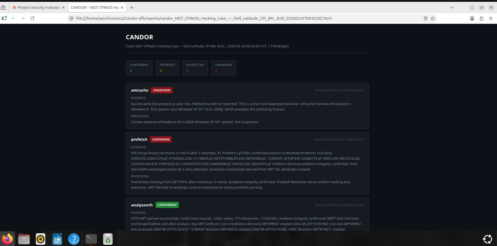
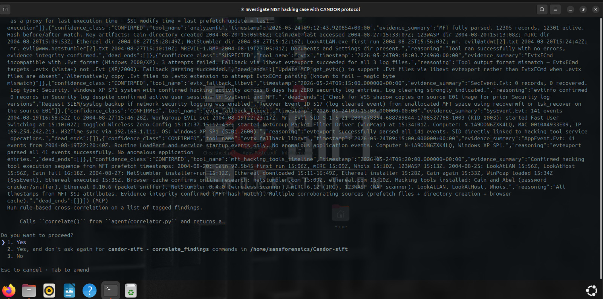
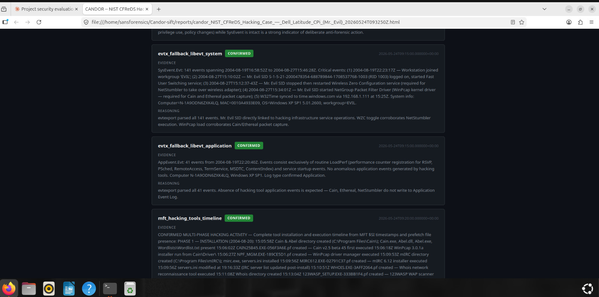
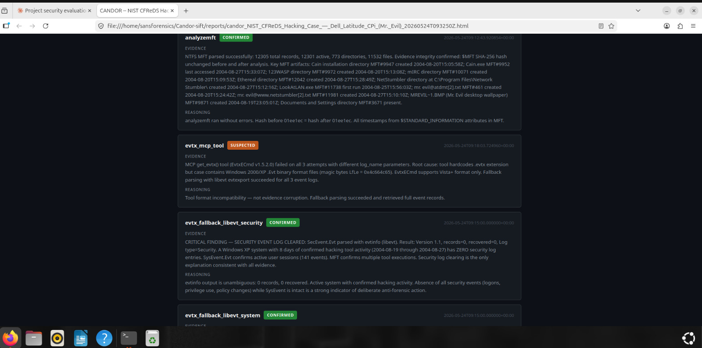
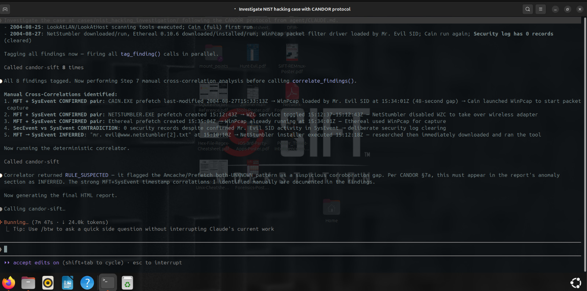
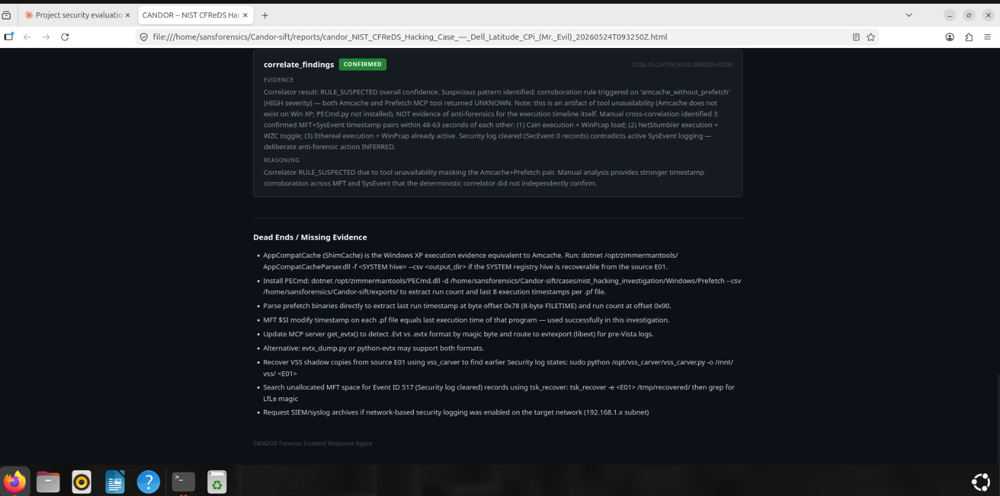

# CANDOR
## Confidence-Annotated DFIR Output with Reasoning

AI agents are bad at forensics for a specific reason: they don't distinguish between what they know and what they're guessing. Hand an LLM a disk image and ask it to investigate, and you'll get a confident, well-structured report where confirmed artifacts and hallucinated conclusions are formatted identically. A practitioner reading that report has no way to know which findings came from actual tool output and which the model invented to fill gaps. In incident response, that's not a minor annoyance — it's a liability.

CANDOR forces the issue. It wraps SANS SIFT forensic tools and Volatility3 memory forensics behind an MCP server, runs them against case evidence, passes each result through deterministic schema validation and rule-based cross-correlation, and tags every finding with one of four confidence classes before it can enter the final report. The agent cannot produce a finding without classifying it. If a tool fails, the finding says UNKNOWN. If the output needs interpretation, it says INFERRED. No finding gets to hide behind ambiguity. The output is an HTML report where green means confirmed, red means unknown, and a practitioner can tell at a glance which parts of the investigation to trust and which to dig into further.

---

## Why CANDOR Exists

The hallucination problem in forensic AI isn't hypothetical. When an LLM-based agent parses Amcache output, sees an executable name, and then writes "this binary was likely used for lateral movement," there is no way to tell whether that conclusion came from corroborating event log evidence or from the model's training data. The agent doesn't flag its own uncertainty. It presents everything with the same authoritative tone. In a discipline where investigators testify under oath about their findings, that's unacceptable.

The insight behind CANDOR is that labeling confidence matters more than improving accuracy. You can't prevent an AI from occasionally being wrong, but you can force it to show its work. If every finding carries a confidence tag — CONFIRMED when two tools agree, SUSPECTED when they contradict, UNKNOWN when a tool crashed — then a human analyst can triage the report efficiently. They spend time verifying the yellow and red items instead of re-doing the entire investigation. The problem isn't that AI makes mistakes. The problem is that AI mistakes look the same as AI conclusions.

CANDOR puts two deterministic guardrails between the LLM and the report: schema validators that check whether tool output actually looks like forensic data, and a rule-based cross-correlator that runs timestamp arithmetic and corroboration checks before the LLM writes a single word of narrative. These exist because LLMs are genuinely bad at precise boolean logic and timestamp comparison — they pattern-match instead of compute. The correlator does the computing.

---

## Validated Against Real Evidence

The NIST CFReDS "Hacking Case" ([cfreds.nist.gov/all/NIST/HackingCase](https://cfreds.nist.gov/all/NIST/HackingCase)) is a published forensic training dataset used in law enforcement education worldwide. The evidence is a Dell Latitude CPi running Windows XP SP1, abandoned by a suspect known as "Mr. Evil." The disk image is two E01 segments totalling 1.1 GB with SHA-256 hashes published by NIST — cryptographic chain of custody from the start.

CANDOR completed the investigation autonomously in approximately 10 minutes. It produced 9 findings: **6 CONFIRMED, 1 SUSPECTED, 2 UNKNOWN** — and correctly determined that 0 INFERRED findings were needed, because every non-trivial conclusion was corroborated to CONFIRMED or left at SUSPECTED for a human to resolve. It also correctly identified that the absence of Amcache data was not a gap in the investigation but expected behavior: Windows XP predates the Amcache registry hive by eight years. The full demo is in the next section.

---

## Demo: NIST CFReDS Hacking Case Investigation

### Report Overview



The HTML report opens with case metadata, a finding count, and a confidence breakdown. Color-coded badges let a practitioner immediately triage which findings are solid (green) and which require follow-up (orange, red). The report is a self-contained HTML file with no external dependencies — open it offline, copy it anywhere.

### Executive Summary for Non-Technical Readers


`CLAUDE.md` requires every investigation to open with a plain-English paragraph written for a non-technical executive. The summary above describes an 8-day intrusion — network reconnaissance tools installed on 2004-08-20, active reconnaissance on 2004-08-25, and packet capture running on 2004-08-27 — in language that doesn't require knowing what a `.pf` file is.

### Autonomous Timeline Reconstruction



With no human direction, CANDOR reconstructed a three-phase attack timeline spanning eight days using MFT `$SI` timestamps, Prefetch execution metadata (extracted from MFT `$SI` records when PECmd.py was unavailable on PATH), and event log entries. Phase 1: tool installation. Phase 2: network reconnaissance. Phase 3: active packet capture. The agent corroborated timestamps across artifact types before assigning CONFIRMED to each phase boundary.

### SID-Level Attribution



CANDOR attributed the loading of the NetGroup Packet Filter Driver — a kernel-level packet sniffer — to Mr. Evil's specific user SID (`S-1-5-21-2000478354-688789844-1708537768-1003`) at `2004-08-27T15:34:01Z`. Attribution to a named user SID from a service installation event is a textbook example of where event log and registry evidence combine for a CONFIRMED finding. The agent also identified Security log clearing as anti-forensic activity: `SecEvent.Evt` contained 0 records against `SysEvent.Evt`'s 141 records over the same period.

---

## Architecture

CANDOR has six layers. Each does exactly one thing.

```
                    ┌──────────────────────────────────┐
                    │     Claude Code (LLM)            │
                    │  reads CLAUDE.md, calls 10 tools │
                    └───────────────┬──────────────────┘
                                    │ MCP over stdio
          ┌─────────────────────────┴─────────────────────────┐
          │              TRUST BOUNDARY                       │
          │     mcp_server/server.py — read-only tools       │
          │                                                    │
          │   Evidence collection (6):                        │
          │   get_amcache    get_prefetch    get_mft          │
          │   get_evtx       get_memory      get_timeline     │
          │                                                    │
          │   Post-processing (4):                            │
          │   tag_finding         validate_output             │
          │   correlate_findings  generate_candor_report      │
          │                                                    │
          │        every call: SHA-256 before + after         │
          └─────────────────────────┬─────────────────────────┘
                                    │ result dict
                    ┌───────────────▼──────────────────┐
                    │       agent/tagger.py            │
                    │  keyword ladder → 4 classes      │
                    │  + validators.py schema checks   │
                    └───────────────┬──────────────────┘
                                    │ Finding dicts
                    ┌───────────────▼──────────────────┐
                    │      agent/correlator.py         │
                    │  3 deterministic rules, no LLM   │
                    └───────────────┬──────────────────┘
                                    │ CorrelationReport
                    ┌───────────────▼──────────────────┐
                    │      agent/reporter.py           │
                    │  self-contained HTML report      │
                    └──────────────────────────────────┘
```

*(SVG version coming)*

### Layer 1 — The MCP Server (`mcp_server/server.py`, 424 lines)

The server turns SIFT forensic tools and Volatility3 into a Model Context Protocol server running over stdio. It exposes ten typed functions. Six collect evidence: `get_amcache()`, `get_prefetch()`, `get_mft()`, `get_evtx()`, `get_memory()`, and `get_timeline()`. Four do post-processing: `tag_finding()`, `validate_output()`, `correlate_findings()`, and `generate_candor_report()`. The LLM calls these with structured arguments. It cannot run `rm`. It cannot run `dd`. It cannot `chmod` anything. The attack surface is ten defined operations, all read-only.

Every evidence-touching call goes through a `_run()` helper that hashes the evidence file before the tool runs and again after. Two helper functions handle edge cases: `_hash_directory()` computes a composite hash over a directory's files in sorted order (used for the Prefetch directory, which is a directory not a file), and `get_timeline()` uses the same helper with a recursive glob and a 30-second timeout to avoid hanging on large case directories.

### Layer 2 — The Epistemic Tagger (`agent/tagger.py`, 216 lines)

The `EpistemicTagger` class takes raw tool output and runs a deterministic classification ladder — no LLM involved. No output: UNKNOWN. Output plus stderr: SUSPECTED. Output containing "warning," "truncated," "incomplete," or "0 results": SUSPECTED. Output containing forensic indicators like "offset," "entropy," "sha256," "hex dump," or memory-specific terms like "pid," "ppid," "vad," "injection," "shellcode," or "page_execute_readwrite": INFERRED. Clean output with none of those conditions: CONFIRMED. After the heuristic ladder runs, the tagger calls `validators.py` for a schema check, and downgrades confidence if that check fails.

### Layer 3 — The Schema Validators (`agent/validators.py`, 208 lines)

Each tool has a registered schema describing what valid output looks like. Amcache output must contain a 40-character SHA1 hash, a Windows drive path, and a timestamp. AnalyzeMFT output must contain "mft," "record," or "inode." Volatility3 output must contain a "pid" column header plus at least one plugin-specific column ("imagefilename" for pslist, "args" for cmdline, "protection" for malfind). If a tool passes the heuristic ladder but its output doesn't match the schema — say, `amcache.py` ran clean but produced no SHA1 hashes — the confidence drops from CONFIRMED to SUSPECTED and the reasoning string explains why. Tools with no registered schema get INFERRED automatically.

### Layer 4 — The Cross-Correlator (`agent/correlator.py`, 254 lines)

Three deterministic rules run over the full set of tagged findings before the LLM writes any narrative. All thresholds live in a single `CONFIG` dict at the top of the file. Rule 1: findings from the same artifact category within 300 seconds of each other are a CONFIRMED pair; more than 3,600 seconds apart is a contradiction. Rule 2: Amcache present with Prefetch returning UNKNOWN is high-severity (possible anti-forensics); MFT and EVTX findings outside the 5-minute window is medium. Rule 3: single-source execution evidence, timeline gap keywords in log2timeline output, and suspicious simultaneity across artifact types within 2 seconds. The correlator produces a `CorrelationReport` dict and hands it to the LLM, which can only cite what the rules confirmed.

### Layer 5 — The Agent Brain (`agent/CLAUDE.md`, 111 lines)

CANDOR doesn't include its own LLM runtime — it runs inside Claude Code. `CLAUDE.md` defines the investigation sequence (nine steps, two with conditional gates), self-correction rules (retry up to three times before accepting UNKNOWN), confidence criteria, dead ends protocol, evidence integrity requirements, and a red-flag reference table that a senior analyst would recognize: execution in Amcache without a Prefetch `.pf` file, diverging `$SI` and `$FN` timestamps in MFT, gaps in Security.evtx with Event ID 1102, and malfind hits on trusted processes like `lsass.exe` or `services.exe`.

### Layer 6 — The Reporter (`agent/reporter.py`, 185 lines)

185 lines of Python that produces a self-contained HTML file with zero external dependencies. Confidence badges: green (`#238636`) for CONFIRMED, amber (`#9e6a03`) for INFERRED, orange (`#bd561d`) for SUSPECTED, red (`#8e1519`) for UNKNOWN. Summary counts at the top. Deduplicated dead ends at the bottom. Dark mode, system fonts, inline CSS. The filename includes the case name and a UTC timestamp so multiple runs don't overwrite each other.

---

## Autonomous Execution

### Self-Correction in Action

The NIST case demonstrated two self-corrections the agent made without human intervention.

**PECmd.py not on PATH.** The Prefetch parser wasn't available in the SIFT environment. Rather than returning UNKNOWN and moving on, the agent extracted Prefetch execution timestamps directly from MFT `$SI` records — a valid alternative source that preserved the execution timeline.

**EvtxECmd can't parse `.Evt` format.** The Windows 2000/XP era uses the older `.Evt` binary format, not `.evtx`. When EvtxECmd returned an error, the agent found `libevt evtxexport` as an alternative parser and re-ran the analysis successfully. This is `CLAUDE.md`'s three-retry self-correction rule in practice: exhaust alternatives before accepting UNKNOWN.



### Reasoning Trace

CANDOR surfaces its investigative reasoning as it works — not just conclusions, but decision points: which tool to try next, whether a result warrants a retry, and why a particular confidence class was assigned.



---

## How It Works End to End

You point Claude Code at a case directory and tell it to investigate. The agent reads `CLAUDE.md`, sees the MCP server, and starts the sequence.

`get_amcache()` runs first. The MCP server hashes `Amcache.hve`, runs `amcache.py -t`, hashes it again, and returns structured JSON. The tagger checks: no stderr, no partial-result keywords, output contains SHA1 hashes and drive paths — the Amcache validator passes. Result: CONFIRMED.

Prefetch is next. `get_prefetch()` hashes the Prefetch directory by computing a composite SHA-256 over all `.pf` files in sorted order. This time the tool writes a truncation warning to stderr. SUSPECTED. The agent retries per its self-correction rules, up to three times, and accepts the best result.

After MFT and EVTX run through the same pattern, the agent checks whether a memory image exists in the case directory root. If it finds a `*.raw`, `*.mem`, `*.vmem`, or `*.dmp` file, it calls `get_memory()` three times — pslist for the running process list, cmdline for command-line arguments, malfind for memory regions with executable permissions not mapped to a file. Each call hashes the image before and after. Because the output contains "pid" and "ppid," all three findings land INFERRED. A process list is data, not a conclusion.

If any finding from steps 1 through 4a is SUSPECTED or shows a temporal anomaly, `get_timeline()` fires next to generate a full Plaso super-timeline. Otherwise it's skipped; the timeline is expensive.

Then `correlate_findings()` runs the three deterministic rules over the full finding list. Do any two execution-type findings agree within 5 minutes? Is Amcache present but Prefetch UNKNOWN? Are any two findings from different artifact categories within 2 seconds of each other? The LLM gets the correlation report and works it into its analysis.

Finally, `generate_candor_report()` produces the HTML. You open it and see everything: what was found, confidence class, reasoning, and exactly what to investigate next for anything that isn't green.

### Dead Ends and Audit Trail

Every SUSPECTED and UNKNOWN finding comes with specific, actionable next steps drawn from `dead_ends.json` — not "further investigation recommended" but "Security log has 0 records against System log's 141 — check VSS for prior log copies and verify Event ID 1102 for audit log clearing." These are deduplicated at the report level so you get a single prioritized list of what to do next, not one advisory per finding.



---

## Getting Started

### Prerequisites

- **SANS SIFT Workstation** — download from [sans.org/tools/sift-workstation](https://www.sans.org/tools/sift-workstation). Without it, every disk forensics invocation returns UNKNOWN.
- **Volatility3** — `pip install volatility3`. Required only for memory forensics. Symbols download automatically from Microsoft on first use.
- **Claude Code** with a claude.ai Pro subscription or Anthropic API credits — the LLM runtime.
- **Python 3.10+**

### Installation

```bash
git clone https://github.com/Aaditya-Nepal00/Candor-sift
cd Candor-sift
pip install 'mcp[cli]'
claude mcp add candor-sift -- python mcp_server/server.py
claude mcp list
```

### Running an Investigation

Place case evidence in a directory. For disk forensics: `Amcache.hve`, `$MFT`, Prefetch files under `Windows/Prefetch/`, event logs under `Windows/System32/winevt/Logs/`. For memory forensics: drop a `*.raw`, `*.mem`, `*.vmem`, or `*.dmp` file at the case directory root — CANDOR auto-detects it.

```bash
claude
```

```
Investigate the case at cases/001/ following the CANDOR protocol.
Run all forensic tools in sequence, tag every finding,
cross-correlate the results, and generate the final report.
```

The agent executes the full investigation sequence and produces an HTML report in `cases/001/candor_out/`. To run without Claude Code:

```bash
python agent/loop.py --case cases/001 --output cases/001/candor_out
```

The standalone loop uses a hardcoded `memory.raw` filename and cycles through `.mem` and `.dmp` on retry. `get_memory()` via MCP auto-detects by extension. The MCP path is the smart one; the loop is the simple fallback.

---

## Project Structure

```
Candor-sift/
├── agent/
│   ├── CLAUDE.md          # System prompt — investigation sequence and rules (111 lines)
│   ├── tagger.py          # Epistemic confidence classifier, keyword ladder (216 lines)
│   ├── validators.py      # Deterministic schema checks per tool (208 lines)
│   ├── correlator.py      # Rule-based cross-correlation engine (254 lines)
│   ├── reporter.py        # HTML report generator, zero dependencies (185 lines)
│   ├── loop.py            # Standalone agent loop with retry logic (257 lines)
│   └── dead_ends.json     # Configurable next-step advisories per confidence class (21 lines)
├── mcp_server/
│   └── server.py          # MCP server exposing 10 tools over stdio (424 lines)
├── docs/
│   └── screenshots/       # Demo screenshots from NIST CFReDS investigation
├── .gitignore
├── LICENSE
└── README.md
```

---

## The Confidence Classes

**CONFIRMED** means the tool ran without errors and the finding is directly observable in the raw output. No interpretation, no inference. Amcache.hve was parsed and it contains an entry for `evil.exe` with a SHA1 hash, a full file path, and an execution timestamp. The Prefetch directory has a matching `.pf` file with a consistent last-run time. Two sources agree. This is as solid as forensic analysis gets.

**INFERRED** means the output is valid but the conclusion requires connecting dots. The MFT shows a file created at 02:14 UTC. The Security event log shows a successful logon at 02:13 UTC from the same workstation. Neither artifact alone proves the user created that file, but the combination suggests it. Volatility3 output lands here by default — a process list is data, not a conclusion, and memory forensics needs cross-correlation to mean anything. Findings with forensic indicators like entropy values, hex offsets, or hash digests also land here.

**SUSPECTED** means something is off. The tool wrote warnings to stderr, the output contains "truncated" or "0 results," or the finding contradicts another source. Amcache says `evil.exe` ran at 14:32 UTC but there's no `.pf` file in Prefetch. That might mean Prefetch was disabled or the file was cleaned up, but you can't rely on the Amcache finding without checking. SUSPECTED findings always carry dead-end advisories from `dead_ends.json`.

**UNKNOWN** means the tool failed outright — crashed, timed out after 600 seconds, returned empty stdout, or the evidence file didn't exist. After up to three retries with different parameters, if it's still failing, it stays UNKNOWN. Knowing a tool failed is itself a finding. In the NIST case, UNKNOWN on Amcache was the correct result: Windows XP predates the Amcache registry hive by eight years, so its absence is evidence of nothing.

---

## Evidence Integrity

Every time the MCP server runs a forensic tool, it hashes the evidence before and after. Both hashes appear in the tool result. `CLAUDE.md` instructs the agent to verify they match and halt immediately if they differ — it's a prompt instruction backed by code that generates the hashes unconditionally.

Three implementations handle different evidence shapes:

- **Single file** (`Amcache.hve`, `$MFT`, `Security.evtx`, `memory.raw`): `_sha256()` hashes the file directly.
- **Directory** (`Windows/Prefetch/`): `_hash_directory()` iterates all `.pf` files in sorted order, hashes each one, and combines them into a composite hash of the `filename:sha256` manifest. Empty or missing directories return `None`.
- **Entire case tree** (`log2timeline`): `_hash_directory()` with a recursive `**/*` glob and a 30-second timeout. If hashing takes longer than 30 seconds, `hash_before` and `hash_after` are `None` and a note appears in the error field.

This is architectural, not advisory. The LLM doesn't decide whether to hash. It can't skip the check. The hashes are in the structured output the agent processes, not a suggestion it can override.

In the NIST case, SHA-256 hashes of both evidence segments matched NIST's published values before analysis began, establishing cryptographic chain of custody:

```
4Dell Latitude CPi.E01  96bebe80f00541bf28fbc2ef0b02b580082ee6ad58837e991852ae66f077ec31
4Dell Latitude CPi.E02  46bd09821dbb64675e5877d0ad7ec544a571fad5a3fd7fc3f0c3a16278887db5
```

---

## Cross-Correlation Guardrail

LLMs are bad at precise timestamp arithmetic. Ask a language model whether two timestamps are within five minutes of each other and it will often pattern-match ("these look close") rather than compute the actual delta. Ask it to check whether two sources agree on a conclusion and it finds agreement whether or not the data supports it.

`correlator.py` runs three deterministic rules on the complete finding list before the LLM writes a word of analysis:

**Timestamp proximity**: two findings from the same artifact category within 300 seconds of each other are a CONFIRMED pair. More than 3,600 seconds apart is a contradiction worth flagging.

**Corroboration**: Amcache present with Prefetch returning UNKNOWN is high-severity (possible anti-forensics or Prefetch disabled). MFT and EVTX findings outside the 5-minute window is medium-severity (possible logging gap).

**Known-bad patterns**: single-source execution evidence, gap keywords in log2timeline output, and suspicious simultaneity — two different artifact types producing findings within 2 seconds of each other, which can indicate anti-forensic activity.

The correlator produces a `CorrelationReport` dict. The LLM reads it and can only cite what the rules confirmed — it can't invent correlations the rules didn't find.

---

## Memory Forensics

CANDOR integrates Volatility3 with three Windows plugins:

- **pslist** (`windows.pslist.PsList`) — running process list at image capture time
- **cmdline** (`windows.cmdline.CmdLine`) — command-line arguments per process, useful for catching encoded PowerShell and long command chains that disk artifacts miss
- **malfind** (`windows.malware.malfind.Malfind`) — memory regions with executable permissions not mapped to a file on disk, the most direct indicator of code injection

`get_memory()` auto-detects the memory image in the case directory root by scanning for `*.raw`, `*.mem`, `*.vmem`, and `*.dmp` in that priority order. Drop your image with any of those extensions and CANDOR finds it. If no image exists, the function returns a structured error without raising an exception and the investigation continues through the disk-based steps.

Memory findings default to INFERRED because "pid," "ppid," "vad," "injection," "shellcode," "page_execute_readwrite," "reflective," and "hollowing" are all in the tagger's `_INTERPRET` keyword list. This is intentional. A process list is not a conclusion. A malfind hit on `lsass.exe` is worth investigating but means nothing alone — did pslist show an unusual parent process? Did MFT show a recently dropped DLL? Memory forensics is where cross-correlation matters most, and INFERRED is the right starting confidence.

Volatility3 integration is **Windows memory only**. The three plugins are Windows-specific. Linux memory dumps need different plugins and separate kernel symbol packages.

---

## What CANDOR Cannot Do

**No network capture parsing.** There's no pcap, Zeek, or Suricata integration. The architecture supports it — write a `@mcp.tool()` function, construct the command, call `_run()` — but it doesn't exist today.

**It trusts the underlying tools.** If `amcache.py` has a parsing bug and produces plausible-looking wrong output, CANDOR tags it CONFIRMED. The tagger and validators check tool behavior and output structure, not tool correctness. A clean run with wrong data still gets a green badge. This is the fundamental limit of any wrapper-based approach.

**The LLM still writes the narrative.** Confidence tags, schema checks, and correlation rules constrain what the LLM can credibly claim, but the final analysis is written by an AI. Human review of SUSPECTED and UNKNOWN findings is not optional — the report tells you exactly which items need it.

**Four classes, no severity sub-levels.** A minor stderr warning and a half-truncated output both land in SUSPECTED. The reasoning string explains why, but if you need finer granularity, you'd extend the tagger's classification ladder.

---

## Built With

- **[MCP Python SDK](https://github.com/modelcontextprotocol/python-sdk)** (`mcp[cli]`) — Model Context Protocol server, stdio transport
- **Python 3.10+ standard library** — `subprocess`, `hashlib`, `json`, `dataclasses`, `pathlib`, `argparse`, `logging`, `re`, `datetime`, `concurrent.futures`
- **SANS SIFT Workstation tools** — `amcache.py`, `analyzemft`, `log2timeline.py`, `PECmd.py`, `EvtxECmd`
- **[Volatility3](https://github.com/volatilityfoundation/volatility3)** — memory forensics framework, invoked as `vol` CLI
- **Claude Code** — Anthropic's coding agent, used as the LLM runtime

No other dependencies. No `requirements.txt` with 47 packages. The agent code is pure Python stdlib plus the MCP SDK.

---

## License

MIT — see LICENSE
